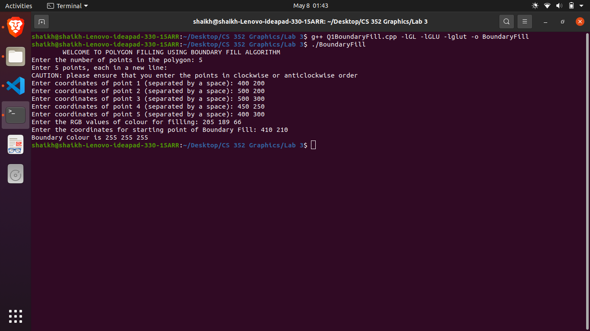
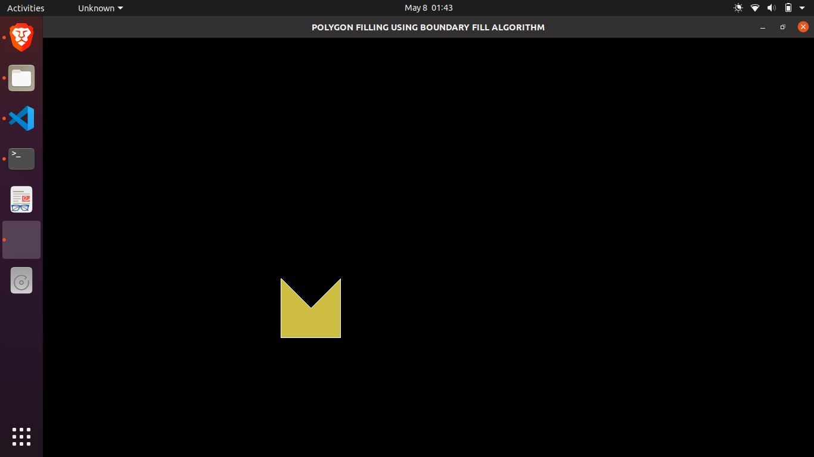
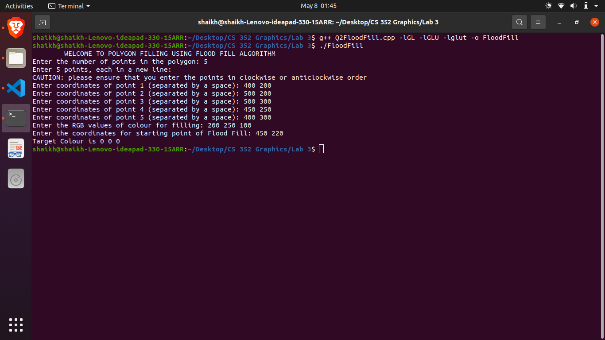
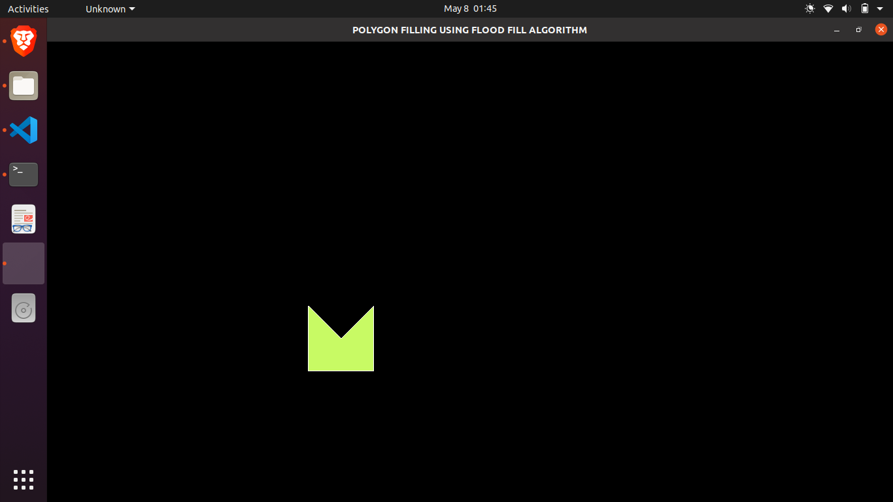
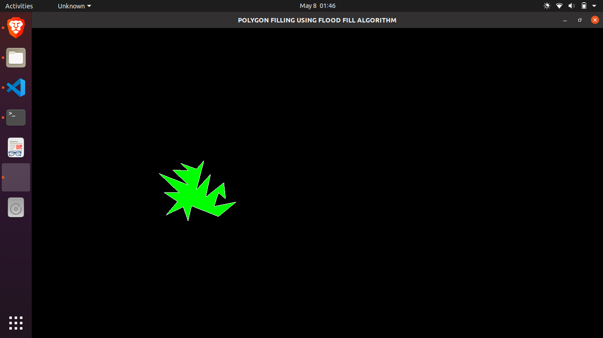
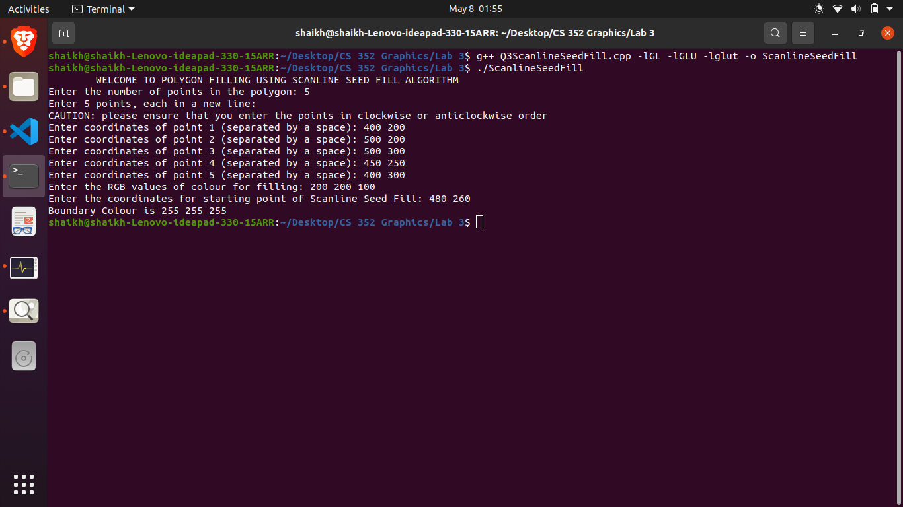
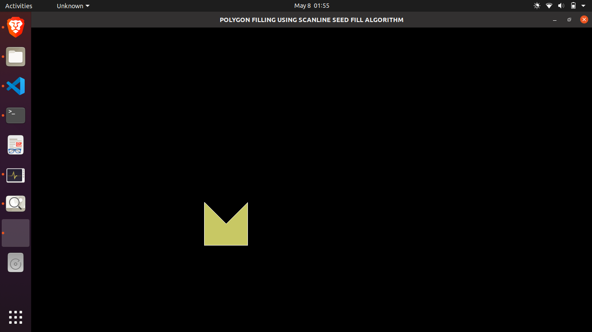
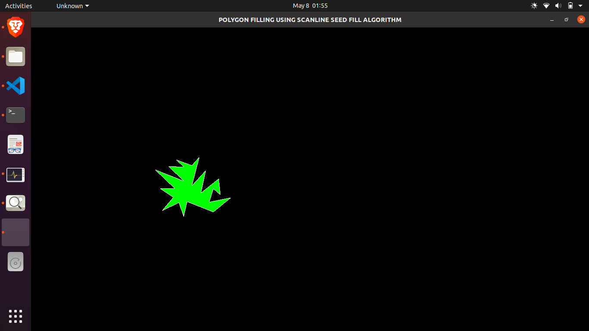

<html><head><meta content="text/html; charset=UTF-8" http-equiv="content-type"></head><body class="c16">
Name: Shaikh Ubaid

Roll no: 180001050

Date: 8 May, 2021

Assignment no: 3

Course: Computer Graphics

Q1: Boundary Fill

Code:
<table class="c6"><tbody><tr class="c13"><td class="c15" colspan="1" rowspan="1">
#include &lt;GL/glut.h&gt; /* for using glut library */ #include &lt;cstdio&gt; &nbsp; &nbsp;/* for using printf and scanf */ #include &lt;vector&gt; &nbsp; &nbsp;/* for using vector */  #define WINDOW_WIDTH 1294 #define WINDOW_HEIGHT 704  // #define WINDOW_WIDTH 600 // #define WINDOW_HEIGHT 400  /* defining a structure for representing a point of the polygon */ typedef&nbsp;struct&nbsp;Point {  &nbsp; int&nbsp;x, y; } Point;  /* defining a structure for representing a colour of a point */ typedef&nbsp;struct&nbsp;Colour {  &nbsp; unsigned&nbsp;char&nbsp;red, green, blue; } Colour;  int&nbsp;no_of_polygon_points; std::vector&lt;Point&gt; polygon; Point starting_point; Colour cur_pixel, fill_colour, boundary_colour;  /* declaring the functions */ void&nbsp;init(void); void&nbsp;drawPolygon(std::vector&lt;Point&gt;); int&nbsp;isColourEqual(Colour *c1, Colour *c2); int&nbsp;isValid(int&nbsp;x, int&nbsp;y); void&nbsp;putPixel(int&nbsp;x, int&nbsp;y); void&nbsp;getPixel(int&nbsp;x, int&nbsp;y); void&nbsp;boundaryFill(int&nbsp;x, int&nbsp;y); void&nbsp;display(void);  int&nbsp;main(int&nbsp;argc, char&nbsp;**argv) {  &nbsp; printf(&quot;\tWELCOME TO POLYGON FILLING USING BOUNDARY FILL ALGORITHM\n&quot;); /* showing welcome message */  &nbsp; /* prompting the user for input */  &nbsp; printf(&quot;Enter the number of points in the polygon: &quot;);  &nbsp; scanf(&quot;%d&quot;, &amp;no_of_polygon_points);  &nbsp; printf(&quot;Enter %d points, each in a new line:\n&quot;, no_of_polygon_points);  &nbsp; printf(&quot;CAUTION: please ensure that you enter the points in clockwise or anticlockwise order\n&quot;);  &nbsp; polygon.resize(no_of_polygon_points);  &nbsp; for&nbsp;(int&nbsp;i = 0; i &lt; no_of_polygon_points; ++i)  &nbsp; {  &nbsp; &nbsp; &nbsp; printf(&quot;Enter coordinates of point %d (separated by a space): &quot;, i + 1);  &nbsp; &nbsp; &nbsp; scanf(&quot;%d %d&quot;, &amp;polygon[i].x, &amp;polygon[i].y);  &nbsp; }  &nbsp; printf(&quot;Enter the RGB values of colour for filling: &quot;);  &nbsp; scanf(&quot;%d %d %d&quot;, (int&nbsp;*)&amp;fill_colour.red, (int&nbsp;*)&amp;fill_colour.green, (int&nbsp;*)&amp;fill_colour.blue);   &nbsp; printf(&quot;Enter the coordinates for starting point of Boundary Fill: &quot;);  &nbsp; scanf(&quot;%d %d&quot;, &amp;starting_point.x, &amp;starting_point.y);   &nbsp; glutInit(&amp;argc, argv); &nbsp; &nbsp; &nbsp; &nbsp; &nbsp; &nbsp; &nbsp; &nbsp; &nbsp; &nbsp; &nbsp; &nbsp; &nbsp; &nbsp; &nbsp; &nbsp; &nbsp; &nbsp; &nbsp; &nbsp; &nbsp; &nbsp; /* initializing glut */  &nbsp; glutInitDisplayMode(GLUT_SINGLE); &nbsp; &nbsp; &nbsp; &nbsp; &nbsp; &nbsp; &nbsp; &nbsp; &nbsp; &nbsp; &nbsp; &nbsp; &nbsp; &nbsp; &nbsp; &nbsp; &nbsp;/* use single color buffer and no depth buffer */  &nbsp; glutInitWindowSize(WINDOW_WIDTH, WINDOW_HEIGHT); &nbsp; &nbsp; &nbsp; &nbsp; &nbsp; &nbsp; &nbsp; &nbsp; &nbsp; /* setting size of display area, in pixels. */  &nbsp; glutInitWindowPosition(0, 0); &nbsp; &nbsp; &nbsp; &nbsp; &nbsp; &nbsp; &nbsp; &nbsp; &nbsp; &nbsp; &nbsp; &nbsp; &nbsp; &nbsp; &nbsp; &nbsp; &nbsp; &nbsp; &nbsp;/* setting location of window in screen coordinates. */  &nbsp; glutCreateWindow(&quot;POLYGON FILLING USING BOUNDARY FILL ALGORITHM&quot;); /* giving name/title to window */  &nbsp; init(); &nbsp; &nbsp; &nbsp; &nbsp; &nbsp; &nbsp; &nbsp; &nbsp; &nbsp; &nbsp; &nbsp; &nbsp; &nbsp; &nbsp; &nbsp; &nbsp; &nbsp; &nbsp; &nbsp; &nbsp; &nbsp; &nbsp; &nbsp; &nbsp; &nbsp; &nbsp; &nbsp; &nbsp; &nbsp; &nbsp;/* setting our own OpenGL initialization */  &nbsp; glutDisplayFunc(display); &nbsp; &nbsp; &nbsp; &nbsp; &nbsp; &nbsp; &nbsp; &nbsp; &nbsp; &nbsp; &nbsp; &nbsp; &nbsp; &nbsp; &nbsp; &nbsp; &nbsp; &nbsp; &nbsp; &nbsp; &nbsp;/* register display() function as the callback handler for window-paint event */  &nbsp; glutMainLoop(); &nbsp; &nbsp; &nbsp; &nbsp; &nbsp; &nbsp; &nbsp; &nbsp; &nbsp; &nbsp; &nbsp; &nbsp; &nbsp; &nbsp; &nbsp; &nbsp; &nbsp; &nbsp; &nbsp; &nbsp; &nbsp; &nbsp; &nbsp; &nbsp; &nbsp; &nbsp;/* run the event loop! This function does not return */  &nbsp; /* Program ends when user closes the window */  &nbsp; return&nbsp;0; }  void&nbsp;init(void)&nbsp;/* initialize OpenGL Graphics */ {  &nbsp; glClearColor(0.0, 0.0, 0.0, 1.0); /* set the &quot;clearing&quot; or background color as black and opaque*/  &nbsp; glColor3ub(255, 255, 255); &nbsp; &nbsp; &nbsp; &nbsp;/* set white colour as drawing colour */  &nbsp; // glColor3i(255, 255, 255);  &nbsp; glPointSize(1.0); &nbsp; &nbsp; &nbsp; &nbsp; &nbsp; &nbsp; &nbsp; &nbsp; /* each pixel is of size 1x1 */  &nbsp; glMatrixMode(GL_PROJECTION);  &nbsp; glLoadIdentity();  &nbsp; gluOrtho2D(0, WINDOW_WIDTH, 0, WINDOW_HEIGHT); /* setting window dimension in X and Y directions */ }  /* A function for drawing polygon. It expects given polygon points to be in clockwise or anticlockwise order */ void&nbsp;drawPolygon(std::vector&lt;Point&gt; polygon) {  &nbsp; glBegin(GL_LINE_LOOP); /* using line loop so that the polygon is not already filled */  &nbsp; int&nbsp;N = polygon.size();  &nbsp; for&nbsp;(int&nbsp;i = 0; i &lt; N; ++i)  &nbsp; &nbsp; &nbsp; glVertex2i(polygon[i].x, polygon[i].y);  &nbsp; glEnd(); }  /* a function which returns true if given two colours are equal else it returns false */ int&nbsp;isColourEqual(Colour *c1, Colour *c2) {  &nbsp; return&nbsp;((c1-&gt;red == c2-&gt;red) &amp;&amp; (c1-&gt;green == c2-&gt;green) &amp;&amp; (c1-&gt;blue == c2-&gt;blue)); }  /* a function which returns true if given point is inside the window */ int&nbsp;isValid(int&nbsp;x, int&nbsp;y) {  &nbsp; return&nbsp;!(x &lt; 0&nbsp;|| y &lt; 0&nbsp;|| x &gt; WINDOW_WIDTH || y &gt; WINDOW_HEIGHT); }  /* a function to paint a pixel at given coordinates. It paints the pixel with colour value of fill_colour */ void&nbsp;putPixel(int&nbsp;x, int&nbsp;y) {  &nbsp; glRasterPos2i(x, y);  &nbsp; glDrawPixels(1, 1, GL_RGB, GL_UNSIGNED_BYTE, &amp;fill_colour);  &nbsp; glFlush(); }  /* a function to get the colour values at the given coordinates. It stores the colour values in cur_pixel */ void&nbsp;getPixel(int&nbsp;x, int&nbsp;y) {  &nbsp; glReadPixels(x, y, 1, 1, GL_RGB, GL_UNSIGNED_BYTE, &amp;cur_pixel); }  /* my boundary fill function */ void&nbsp;boundaryFill(int&nbsp;x, int&nbsp;y) {  &nbsp; if(!isValid(x, y))  &nbsp; &nbsp; &nbsp; return;   &nbsp; getPixel(x, y);  &nbsp; if&nbsp;(isColourEqual(&amp;cur_pixel, &amp;fill_colour) || isColourEqual(&amp;cur_pixel, &amp;boundary_colour))  &nbsp; &nbsp; &nbsp; return;   &nbsp; putPixel(x, y);  &nbsp; boundaryFill(x - 1, y);  &nbsp; boundaryFill(x + 1, y);  &nbsp; boundaryFill(x, y - 1);  &nbsp; boundaryFill(x, y + 1); }  /* Our display function which runs when the window first appears and whenever there is a request to re-paint the window. */ void&nbsp;display(void) {  &nbsp; glClear(GL_COLOR_BUFFER_BIT); /* clear the color buffer i.e. set background with the current &quot;clearing&quot; color */   &nbsp; drawPolygon(polygon); /* draw the polygon */   &nbsp; glReadPixels(polygon[0].x, polygon[0].y, 1, 1, GL_RGB, GL_UNSIGNED_BYTE, &amp;boundary_colour); /* get the colour of the boundary */   &nbsp; /* printing boundary colour on the console for user verification */  &nbsp; printf(&quot;Boundary Colour is %d %d %d\n&quot;, (int)boundary_colour.red, (int)boundary_colour.green, (int)boundary_colour.blue);   &nbsp; boundaryFill(starting_point.x, starting_point.y); /* fill the polygon */   &nbsp; glFlush(); }
</td></tr></tbody></table>

Input:

Output:

Test Case Input:
<table class="c6"><tbody><tr class="c13"><td class="c15" colspan="1" rowspan="1">
23 300 330 330 310 304 279 343 298 354 266 362 300 423 276 463 309 413 299 423 330 439 316 435 353 394 320 405 372 373 337 390 403 373 384 337 397 355 380 319 382 354 348 288 374 333 331 0 255 0 350 310
</td></tr></tbody></table>

Test Case Output:

Q2: Flood Fill

Code:
<table class="c6"><tbody><tr class="c13"><td class="c15" colspan="1" rowspan="1">
#include &lt;GL/glut.h&gt; /* for using glut library */ #include &lt;cstdio&gt; &nbsp; &nbsp;/* for using printf and scanf */ #include &lt;vector&gt; &nbsp; &nbsp;/* for using vector */ #include &lt;queue&gt; &nbsp; &nbsp; /* for using queue */  #define WINDOW_WIDTH 1294 #define WINDOW_HEIGHT 704  // #define WINDOW_WIDTH 600 // #define WINDOW_HEIGHT 400  /* defining a structure for representing a point of the polygon */ typedef&nbsp;struct&nbsp;Point {  &nbsp; int&nbsp;x, y; } Point;  /* defining a structure for representing colour of a point */ typedef&nbsp;struct&nbsp;Colour {  &nbsp; unsigned&nbsp;char&nbsp;red, green, blue; } Colour;  int&nbsp;no_of_polygon_points; std::vector&lt;Point&gt; polygon; Point starting_point; Colour cur_pixel, replacement_colour, target_colour;  /* declaring the functions */ void&nbsp;init(void); void&nbsp;drawPolygon(std::vector&lt;Point&gt;); int&nbsp;isColourEqual(Colour *c1, Colour *c2); int&nbsp;isValid(int&nbsp;x, int&nbsp;y); void&nbsp;putPixel(int&nbsp;x, int&nbsp;y); void&nbsp;getPixel(int&nbsp;x, int&nbsp;y); void&nbsp;floodFill(); void&nbsp;display(void);  int&nbsp;main(int&nbsp;argc, char&nbsp;**argv) {  &nbsp; printf(&quot;\tWELCOME TO POLYGON FILLING USING FLOOD FILL ALGORITHM\n&quot;); /* showing welcome message */  &nbsp; /* prompting the user for input */  &nbsp; printf(&quot;Enter the number of points in the polygon: &quot;);  &nbsp; scanf(&quot;%d&quot;, &amp;no_of_polygon_points);  &nbsp; printf(&quot;Enter %d points, each in a new line:\n&quot;, no_of_polygon_points);  &nbsp; printf(&quot;CAUTION: please ensure that you enter the points in clockwise or anticlockwise order\n&quot;);  &nbsp; polygon.resize(no_of_polygon_points);  &nbsp; for&nbsp;(int&nbsp;i = 0; i &lt; no_of_polygon_points; ++i)  &nbsp; {  &nbsp; &nbsp; &nbsp; printf(&quot;Enter coordinates of point %d (separated by a space): &quot;, i + 1);  &nbsp; &nbsp; &nbsp; scanf(&quot;%d %d&quot;, &amp;polygon[i].x, &amp;polygon[i].y);  &nbsp; }  &nbsp; printf(&quot;Enter the RGB values of colour for filling: &quot;);  &nbsp; scanf(&quot;%d %d %d&quot;, (int&nbsp;*)&amp;replacement_colour.red, (int&nbsp;*)&amp;replacement_colour.green, (int&nbsp;*)&amp;replacement_colour.blue);   &nbsp; printf(&quot;Enter the coordinates for starting point of Flood Fill: &quot;);  &nbsp; scanf(&quot;%d %d&quot;, &amp;starting_point.x, &amp;starting_point.y);   &nbsp; glutInit(&amp;argc, argv); &nbsp; &nbsp; &nbsp; &nbsp; &nbsp; &nbsp; &nbsp; &nbsp; &nbsp; &nbsp; &nbsp; &nbsp; &nbsp; &nbsp; &nbsp; &nbsp; &nbsp; &nbsp; &nbsp; &nbsp; &nbsp;/* initializing glut */  &nbsp; glutInitDisplayMode(GLUT_SINGLE); &nbsp; &nbsp; &nbsp; &nbsp; &nbsp; &nbsp; &nbsp; &nbsp; &nbsp; &nbsp; &nbsp; &nbsp; &nbsp; &nbsp; &nbsp; /* use single color buffer and no depth buffer */  &nbsp; glutInitWindowSize(WINDOW_WIDTH, WINDOW_HEIGHT); &nbsp; &nbsp; &nbsp; &nbsp; &nbsp; &nbsp; &nbsp; &nbsp;/* setting size of display area, in pixels. */  &nbsp; glutInitWindowPosition(0, 0); &nbsp; &nbsp; &nbsp; &nbsp; &nbsp; &nbsp; &nbsp; &nbsp; &nbsp; &nbsp; &nbsp; &nbsp; &nbsp; &nbsp; &nbsp; &nbsp; &nbsp; /* setting location of window in screen coordinates. */  &nbsp; glutCreateWindow(&quot;POLYGON FILLING USING FLOOD FILL ALGORITHM&quot;); /* giving name/title to window */  &nbsp; init(); &nbsp; &nbsp; &nbsp; &nbsp; &nbsp; &nbsp; &nbsp; &nbsp; &nbsp; &nbsp; &nbsp; &nbsp; &nbsp; &nbsp; &nbsp; &nbsp; &nbsp; &nbsp; &nbsp; &nbsp; &nbsp; &nbsp; &nbsp; &nbsp; &nbsp; &nbsp; &nbsp; &nbsp; /* setting our own OpenGL initialization */  &nbsp; glutDisplayFunc(display); &nbsp; &nbsp; &nbsp; &nbsp; &nbsp; &nbsp; &nbsp; &nbsp; &nbsp; &nbsp; &nbsp; &nbsp; &nbsp; &nbsp; &nbsp; &nbsp; &nbsp; &nbsp; &nbsp; /* register display() function as the callback handler for window-paint event */  &nbsp; glutMainLoop(); &nbsp; &nbsp; &nbsp; &nbsp; &nbsp; &nbsp; &nbsp; &nbsp; &nbsp; &nbsp; &nbsp; &nbsp; &nbsp; &nbsp; &nbsp; &nbsp; &nbsp; &nbsp; &nbsp; &nbsp; &nbsp; &nbsp; &nbsp; &nbsp; /* run the event loop! This function does not return */  &nbsp; /* Program ends when user closes the window */  &nbsp; return&nbsp;0; }  void&nbsp;init(void)&nbsp;/* initialize OpenGL Graphics */ {  &nbsp; glClearColor(0.0, 0.0, 0.0, 1.0); /* set the &quot;clearing&quot; or background color as black and opaque*/  &nbsp; glColor3ub(255, 255, 255); &nbsp; &nbsp; &nbsp; &nbsp;/* set white colour as drawing colour */  &nbsp; // glColor3i(255, 255, 255);  &nbsp; glPointSize(1.0); &nbsp; &nbsp; &nbsp; &nbsp; &nbsp; &nbsp; &nbsp; &nbsp; /* each pixel is of size 1x1 */  &nbsp; glMatrixMode(GL_PROJECTION);  &nbsp; glLoadIdentity();  &nbsp; gluOrtho2D(0, WINDOW_WIDTH, 0, WINDOW_HEIGHT); /* setting window dimension in X and Y directions */ }  /* A function for drawing polygon. It expects given polygon points to be in clockwise or anticlockwise order */ void&nbsp;drawPolygon(std::vector&lt;Point&gt; polygon) {  &nbsp; glBegin(GL_LINE_LOOP); /* using line loop so that the polygon is not already filled */  &nbsp; int&nbsp;N = polygon.size();  &nbsp; for&nbsp;(int&nbsp;i = 0; i &lt; N; ++i)  &nbsp; &nbsp; &nbsp; glVertex2i(polygon[i].x, polygon[i].y);  &nbsp; glEnd(); }  /* a function which returns true if given two colours are equal else it returns false */ int&nbsp;isColourEqual(Colour *c1, Colour *c2) {  &nbsp; return&nbsp;((c1-&gt;red == c2-&gt;red) &amp;&amp; (c1-&gt;green == c2-&gt;green) &amp;&amp; (c1-&gt;blue == c2-&gt;blue)); }  /* a function which returns true if given point is inside the window */ int&nbsp;isValid(int&nbsp;x, int&nbsp;y) {  &nbsp; return&nbsp;!(x &lt; 0&nbsp;|| y &lt; 0&nbsp;|| x &gt; WINDOW_WIDTH || y &gt; WINDOW_HEIGHT); }  /* a function to paint a pixel at given coordinates. It paints the pixel with colour value of fill_colour */ void&nbsp;putPixel(int&nbsp;x, int&nbsp;y) {  &nbsp; glRasterPos2i(x, y);  &nbsp; glDrawPixels(1, 1, GL_RGB, GL_UNSIGNED_BYTE, &amp;replacement_colour);  &nbsp; glFlush(); }  /* a function to get the colour values at the given coordinates. It stores the colour values in cur_pixel */ void&nbsp;getPixel(int&nbsp;x, int&nbsp;y) {  &nbsp; glReadPixels(x, y, 1, 1, GL_RGB, GL_UNSIGNED_BYTE, &amp;cur_pixel); }   /* my floodfill function */ void&nbsp;floodFill() {  &nbsp; std::queue&lt;Point&gt; Q;  &nbsp; Q.push(starting_point);  &nbsp; while&nbsp;(!Q.empty()) /* while queue is not empty */  &nbsp; {  &nbsp; &nbsp; &nbsp; Point cur = Q.front();  &nbsp; &nbsp; &nbsp; Q.pop();  &nbsp; &nbsp; &nbsp; if&nbsp;(!isValid(cur.x, cur.y)) /* if the current point is invalid, go for next iteration */  &nbsp; &nbsp; &nbsp; &nbsp; &nbsp; continue;   &nbsp; &nbsp; &nbsp; getPixel(cur.x, cur.y);  &nbsp; &nbsp; &nbsp; if&nbsp;(isColourEqual(&amp;cur_pixel, &amp;target_colour))  &nbsp; &nbsp; &nbsp; {  &nbsp; &nbsp; &nbsp; &nbsp; &nbsp; putPixel(cur.x, cur.y);  &nbsp; &nbsp; &nbsp; &nbsp; &nbsp; Q.push({cur.x - 1, cur.y});  &nbsp; &nbsp; &nbsp; &nbsp; &nbsp; Q.push({cur.x + 1, cur.y});  &nbsp; &nbsp; &nbsp; &nbsp; &nbsp; Q.push({cur.x, cur.y - 1});  &nbsp; &nbsp; &nbsp; &nbsp; &nbsp; Q.push({cur.x, cur.y + 1});  &nbsp; &nbsp; &nbsp; }  &nbsp; } }  /* Our display function which runs when the window first appears and whenever there is a request to re-paint the window. */ void&nbsp;display(void) {  &nbsp; glClear(GL_COLOR_BUFFER_BIT); /* clear the color buffer i.e. set background with the current &quot;clearing&quot; color */   &nbsp; drawPolygon(polygon); /* draw the polygon */   &nbsp; glReadPixels(starting_point.x, starting_point.y, 1, 1, GL_RGB, GL_UNSIGNED_BYTE, &amp;target_colour); /* get the colour of the points to be painted */  &nbsp;  &nbsp; /* printing target colour on the console for user verification */  &nbsp; printf(&quot;Target Colour is %d %d %d\n&quot;, (int)target_colour.red, (int)target_colour.green, (int)target_colour.blue);   &nbsp; floodFill(); /* fill the polygon */   &nbsp; glFlush(); }
</td></tr></tbody></table>

Input:

Output:

Test Case Input:
<table class="c6"><tbody><tr class="c13"><td class="c15" colspan="1" rowspan="1">
23 300 330 330 310 304 279 343 298 354 266 362 300 423 276 463 309 413 299 423 330 439 316 435 353 394 320 405 372 373 337 390 403 373 384 337 397 355 380 319 382 354 348 288 374 333 331 0 255 0 350 310
</td></tr></tbody></table>

Test Case Output:

Q3: Scanline Seed Fill

Code:
<table class="c6"><tbody><tr class="c13"><td class="c15" colspan="1" rowspan="1">
#include &lt;GL/glut.h&gt; /* for using glut library */ #include &lt;cstdio&gt; &nbsp; &nbsp;/* for using printf and scanf */ #include &lt;vector&gt; &nbsp; &nbsp;/* for using vector */ #include &lt;stack&gt; &nbsp; &nbsp; /* for using stack */  #define WINDOW_WIDTH 1294 #define WINDOW_HEIGHT 704  // #define WINDOW_WIDTH 600 // #define WINDOW_HEIGHT 400  /* defining a structure for representing a point of the polygon */ typedef&nbsp;struct&nbsp;Point {  &nbsp; int&nbsp;x, y; } Point;  /* defining a structure for representing colour of a point */ typedef&nbsp;struct&nbsp;Colour {  &nbsp; unsigned&nbsp;char&nbsp;red, green, blue; } Colour;  int&nbsp;no_of_polygon_points; std::vector&lt;Point&gt; polygon; Point starting_point; Colour cur_pixel, fill_colour, boundary_colour;  /* declaring the functions */ void&nbsp;init(void); void&nbsp;drawPolygon(std::vector&lt;Point&gt;); int&nbsp;isColourEqual(Colour *c1, Colour *c2); int&nbsp;isValid(int&nbsp;x, int&nbsp;y); void&nbsp;putPixel(int&nbsp;x, int&nbsp;y); void&nbsp;getPixel(int&nbsp;x, int&nbsp;y); int&nbsp;isBoundary(int&nbsp;x, int&nbsp;y); int&nbsp;isFilled(int&nbsp;x, int&nbsp;y); void&nbsp;scanlineSeedFill(); void&nbsp;display(void);  int&nbsp;main(int&nbsp;argc, char&nbsp;**argv) {  &nbsp; printf(&quot;\tWELCOME TO POLYGON FILLING USING SCANLINE SEED FILL ALGORITHM\n&quot;); /* showing welcome message */  &nbsp; /* prompting the user for input */  &nbsp; printf(&quot;Enter the number of points in the polygon: &quot;);  &nbsp; scanf(&quot;%d&quot;, &amp;no_of_polygon_points);  &nbsp; printf(&quot;Enter %d points, each in a new line:\n&quot;, no_of_polygon_points);  &nbsp; printf(&quot;CAUTION: please ensure that you enter the points in clockwise or anticlockwise order\n&quot;);  &nbsp; polygon.resize(no_of_polygon_points);  &nbsp; for&nbsp;(int&nbsp;i = 0; i &lt; no_of_polygon_points; ++i)  &nbsp; {  &nbsp; &nbsp; &nbsp; printf(&quot;Enter coordinates of point %d (separated by a space): &quot;, i + 1);  &nbsp; &nbsp; &nbsp; scanf(&quot;%d %d&quot;, &amp;polygon[i].x, &amp;polygon[i].y);  &nbsp; }  &nbsp; printf(&quot;Enter the RGB values of colour for filling: &quot;);  &nbsp; scanf(&quot;%d %d %d&quot;, (int&nbsp;*)&amp;fill_colour.red, (int&nbsp;*)&amp;fill_colour.green, (int&nbsp;*)&amp;fill_colour.blue);   &nbsp; printf(&quot;Enter the coordinates for starting point of Scanline Seed Fill: &quot;);  &nbsp; scanf(&quot;%d %d&quot;, &amp;starting_point.x, &amp;starting_point.y);   &nbsp; glutInit(&amp;argc, argv); &nbsp; &nbsp; &nbsp; &nbsp; &nbsp; &nbsp; &nbsp; &nbsp; &nbsp; &nbsp; &nbsp; &nbsp; &nbsp; &nbsp; &nbsp; &nbsp; &nbsp; &nbsp; &nbsp; &nbsp; &nbsp; &nbsp; /* initializing glut */  &nbsp; glutInitDisplayMode(GLUT_SINGLE); &nbsp; &nbsp; &nbsp; &nbsp; &nbsp; &nbsp; &nbsp; &nbsp; &nbsp; &nbsp; &nbsp; &nbsp; &nbsp; &nbsp; &nbsp; &nbsp; &nbsp;/* use single color buffer and no depth buffer */  &nbsp; glutInitWindowSize(WINDOW_WIDTH, WINDOW_HEIGHT); &nbsp; &nbsp; &nbsp; &nbsp; &nbsp; &nbsp; &nbsp; &nbsp; &nbsp; /* setting size of display area, in pixels. */  &nbsp; glutInitWindowPosition(0, 0); &nbsp; &nbsp; &nbsp; &nbsp; &nbsp; &nbsp; &nbsp; &nbsp; &nbsp; &nbsp; &nbsp; &nbsp; &nbsp; &nbsp; &nbsp; &nbsp; &nbsp; &nbsp; &nbsp;/* setting location of window in screen coordinates. */  &nbsp; glutCreateWindow(&quot;POLYGON FILLING USING SCANLINE SEED FILL ALGORITHM&quot;); /* giving name/title to window */  &nbsp; init(); &nbsp; &nbsp; &nbsp; &nbsp; &nbsp; &nbsp; &nbsp; &nbsp; &nbsp; &nbsp; &nbsp; &nbsp; &nbsp; &nbsp; &nbsp; &nbsp; &nbsp; &nbsp; &nbsp; &nbsp; &nbsp; &nbsp; &nbsp; &nbsp; &nbsp; &nbsp; &nbsp; &nbsp; &nbsp; &nbsp;/* setting our own OpenGL initialization */  &nbsp; glutDisplayFunc(display); &nbsp; &nbsp; &nbsp; &nbsp; &nbsp; &nbsp; &nbsp; &nbsp; &nbsp; &nbsp; &nbsp; &nbsp; &nbsp; &nbsp; &nbsp; &nbsp; &nbsp; &nbsp; &nbsp; &nbsp; &nbsp;/* register display() function as the callback handler for window-paint event */  &nbsp; glutMainLoop(); &nbsp; &nbsp; &nbsp; &nbsp; &nbsp; &nbsp; &nbsp; &nbsp; &nbsp; &nbsp; &nbsp; &nbsp; &nbsp; &nbsp; &nbsp; &nbsp; &nbsp; &nbsp; &nbsp; &nbsp; &nbsp; &nbsp; &nbsp; &nbsp; &nbsp; &nbsp;/* run the event loop! This function does not return */  &nbsp; /* Program ends when user closes the window */  &nbsp; return&nbsp;0; }   void&nbsp;init(void)&nbsp;/* initialize OpenGL Graphics */ {  &nbsp; glClearColor(0.0, 0.0, 0.0, 1.0); /* set the &quot;clearing&quot; or background color as black and opaque*/  &nbsp; glColor3ub(255, 255, 255); &nbsp; &nbsp; &nbsp; &nbsp;/* set white colour as drawing colour */  &nbsp; // glColor3i(255, 255, 255);  &nbsp; glPointSize(1.0); &nbsp; &nbsp; &nbsp; &nbsp; &nbsp; &nbsp; &nbsp; &nbsp; /* each pixel is of size 1x1 */  &nbsp; glMatrixMode(GL_PROJECTION);  &nbsp; glLoadIdentity();  &nbsp; gluOrtho2D(0, WINDOW_WIDTH, 0, WINDOW_HEIGHT); /* setting window dimension in X and Y directions */ }   /* A function for drawing polygon. It expects given polygon points to be in clockwise or anticlockwise order */ void&nbsp;drawPolygon(std::vector&lt;Point&gt; polygon) {  &nbsp; glBegin(GL_LINE_LOOP);  &nbsp; int&nbsp;N = polygon.size();  &nbsp; for&nbsp;(int&nbsp;i = 0; i &lt; N; ++i)  &nbsp; &nbsp; &nbsp; glVertex2i(polygon[i].x, polygon[i].y);  &nbsp; glEnd(); }  /* a function which returns true if given two colours are equal else it returns false */ int&nbsp;isColourEqual(Colour *c1, Colour *c2) {  &nbsp; return&nbsp;((c1-&gt;red == c2-&gt;red) &amp;&amp; (c1-&gt;green == c2-&gt;green) &amp;&amp; (c1-&gt;blue == c2-&gt;blue)); }  /* a function which returns true if given point is inside the window */ int&nbsp;isValid(int&nbsp;x, int&nbsp;y) {  &nbsp; return&nbsp;!(x &lt; 0&nbsp;|| y &lt; 0&nbsp;|| x &gt; WINDOW_WIDTH || y &gt; WINDOW_HEIGHT); }  /* a function to paint a pixel at given coordinates. It paints the pixel with colour value of fill_colour */ void&nbsp;putPixel(int&nbsp;x, int&nbsp;y) {  &nbsp; glRasterPos2i(x, y);  &nbsp; glDrawPixels(1, 1, GL_RGB, GL_UNSIGNED_BYTE, &amp;fill_colour);  &nbsp; glFlush(); }  /* a function to get the colour values at the given coordinates. It stores the colour values in cur_pixel */ void&nbsp;getPixel(int&nbsp;x, int&nbsp;y) {  &nbsp; glReadPixels(x, y, 1, 1, GL_RGB, GL_UNSIGNED_BYTE, &amp;cur_pixel); }  /* a function which returns true if the given coordinates are of a boundary point, else it returns false */ int&nbsp;isBoundary(int&nbsp;x, int&nbsp;y) {  &nbsp; getPixel(x, y);  &nbsp; return&nbsp;isColourEqual(&amp;cur_pixel, &amp;boundary_colour); }  /* a function which returns true if the given coordinates are filled with fill_colour, else it returns false */ int&nbsp;isFilled(int&nbsp;x, int&nbsp;y) {  &nbsp; getPixel(x, y);  &nbsp; return&nbsp;isColourEqual(&amp;cur_pixel, &amp;fill_colour); }  /* my scanline seed fill function */ void&nbsp;scanlineSeedFill() {  &nbsp; std::stack&lt;Point&gt; S;  &nbsp; S.push(starting_point);  &nbsp; while&nbsp;(!S.empty()) /* while stack is not empty */  &nbsp; {  &nbsp; &nbsp; &nbsp; Point cur = S.top();  &nbsp; &nbsp; &nbsp; S.pop();   &nbsp; &nbsp; &nbsp; putPixel(cur.x, cur.y);   &nbsp; &nbsp; &nbsp; int&nbsp;x, y, xleft, xright;  &nbsp; &nbsp; &nbsp; x = cur.x - 1;  &nbsp; &nbsp; &nbsp; while&nbsp;(isValid(x, cur.y) &amp;&amp; !isBoundary(x, cur.y))  &nbsp; &nbsp; &nbsp; { /* fill as left as possible */  &nbsp; &nbsp; &nbsp; &nbsp; &nbsp; putPixel(x, cur.y);  &nbsp; &nbsp; &nbsp; &nbsp; &nbsp; x--;  &nbsp; &nbsp; &nbsp; }  &nbsp; &nbsp; &nbsp; xleft = x + 1; /* extreme left end */   &nbsp; &nbsp; &nbsp; x = cur.x + 1;  &nbsp; &nbsp; &nbsp; while&nbsp;(isValid(x, cur.y) &amp;&amp; !isBoundary(x, cur.y))  &nbsp; &nbsp; &nbsp; { /* fill as right as possible */  &nbsp; &nbsp; &nbsp; &nbsp; &nbsp; putPixel(x, cur.y);  &nbsp; &nbsp; &nbsp; &nbsp; &nbsp; x++;  &nbsp; &nbsp; &nbsp; }  &nbsp; &nbsp; &nbsp; xright = x - 1; /* extreme right end */    &nbsp; &nbsp; &nbsp; /* find spans of unfilled points in the upper scanline */  &nbsp; &nbsp; &nbsp; y = cur.y + 1;  &nbsp; &nbsp; &nbsp; x = xleft;  &nbsp; &nbsp; &nbsp; while&nbsp;(isValid(x, y) &amp;&amp; x &lt;= xright)  &nbsp; &nbsp; &nbsp; {  &nbsp; &nbsp; &nbsp; &nbsp; &nbsp; while&nbsp;(x &lt;= xright &amp;&amp; (isBoundary(x, y) || isFilled(x, y)))  &nbsp; &nbsp; &nbsp; &nbsp; &nbsp; {  &nbsp; &nbsp; &nbsp; &nbsp; &nbsp; &nbsp; &nbsp; x++;  &nbsp; &nbsp; &nbsp; &nbsp; &nbsp; }  &nbsp; &nbsp; &nbsp; &nbsp; &nbsp; int&nbsp;xprev = x;  &nbsp; &nbsp; &nbsp; &nbsp; &nbsp; while&nbsp;(x &lt;= xright &amp;&amp; (!isBoundary(x, y) &amp;&amp; !isFilled(x, y)))  &nbsp; &nbsp; &nbsp; &nbsp; &nbsp; {  &nbsp; &nbsp; &nbsp; &nbsp; &nbsp; &nbsp; &nbsp; xprev = x;  &nbsp; &nbsp; &nbsp; &nbsp; &nbsp; &nbsp; &nbsp; x++;  &nbsp; &nbsp; &nbsp; &nbsp; &nbsp; }  &nbsp; &nbsp; &nbsp; &nbsp; &nbsp; if&nbsp;(xprev != x)  &nbsp; &nbsp; &nbsp; &nbsp; &nbsp; {  &nbsp; &nbsp; &nbsp; &nbsp; &nbsp; &nbsp; &nbsp; S.push({xprev, y}); /* push the extreme right end of the found span */  &nbsp; &nbsp; &nbsp; &nbsp; &nbsp; }  &nbsp; &nbsp; &nbsp; }   &nbsp; &nbsp; &nbsp;  &nbsp; &nbsp; &nbsp; /* find spans of unfilled points in the lower scanline */  &nbsp; &nbsp; &nbsp; y = cur.y - 1;  &nbsp; &nbsp; &nbsp; x = xleft;  &nbsp; &nbsp; &nbsp; while&nbsp;(isValid(x, y) &amp;&amp; x &lt;= xright)  &nbsp; &nbsp; &nbsp; {  &nbsp; &nbsp; &nbsp; &nbsp; &nbsp; while&nbsp;(x &lt;= xright &amp;&amp; (isBoundary(x, y) || isFilled(x, y)))  &nbsp; &nbsp; &nbsp; &nbsp; &nbsp; {  &nbsp; &nbsp; &nbsp; &nbsp; &nbsp; &nbsp; &nbsp; x++;  &nbsp; &nbsp; &nbsp; &nbsp; &nbsp; }  &nbsp; &nbsp; &nbsp; &nbsp; &nbsp; int&nbsp;xprev = x;  &nbsp; &nbsp; &nbsp; &nbsp; &nbsp; while&nbsp;(x &lt;= xright &amp;&amp; (!isBoundary(x, y) &amp;&amp; !isFilled(x, y)))  &nbsp; &nbsp; &nbsp; &nbsp; &nbsp; {  &nbsp; &nbsp; &nbsp; &nbsp; &nbsp; &nbsp; &nbsp; xprev = x;  &nbsp; &nbsp; &nbsp; &nbsp; &nbsp; &nbsp; &nbsp; x++;  &nbsp; &nbsp; &nbsp; &nbsp; &nbsp; }  &nbsp; &nbsp; &nbsp; &nbsp; &nbsp; if&nbsp;(xprev != x)  &nbsp; &nbsp; &nbsp; &nbsp; &nbsp; {  &nbsp; &nbsp; &nbsp; &nbsp; &nbsp; &nbsp; &nbsp; S.push({xprev, y}); /* push the extreme right end of the found span */  &nbsp; &nbsp; &nbsp; &nbsp; &nbsp; }  &nbsp; &nbsp; &nbsp; }  &nbsp; } }  /* Our display function which runs when the window first appears and whenever there is a request to re-paint the window. */ void&nbsp;display(void) {  &nbsp; glClear(GL_COLOR_BUFFER_BIT); /* clear the color buffer i.e. set background with the current &quot;clearing&quot; color */   &nbsp; drawPolygon(polygon); /* draw the polygon */   &nbsp; glReadPixels(polygon[0].x, polygon[0].y, 1, 1, GL_RGB, GL_UNSIGNED_BYTE, &amp;boundary_colour); /* get the colour of the boundary */  &nbsp;  &nbsp; /* printing boundary colour on the console for user verification */  &nbsp; printf(&quot;Boundary Colour is %d %d %d\n&quot;, (int)boundary_colour.red, (int)boundary_colour.green, (int)boundary_colour.blue);   &nbsp; scanlineSeedFill(); /* fill the polygon */   &nbsp; glFlush(); }
</td></tr></tbody></table>

Input:

Output:

Test Case Input:
<table class="c6"><tbody><tr class="c13"><td class="c15" colspan="1" rowspan="1">
23 300 330 330 310 304 279 343 298 354 266 362 300 423 276 463 309 413 299 423 330 439 316 435 353 394 320 405 372 373 337 390 403 373 384 337 397 355 380 319 382 354 348 288 374 333 331 0 255 0 350 310
</td></tr></tbody></table>

Test Case Output:

</body></html>